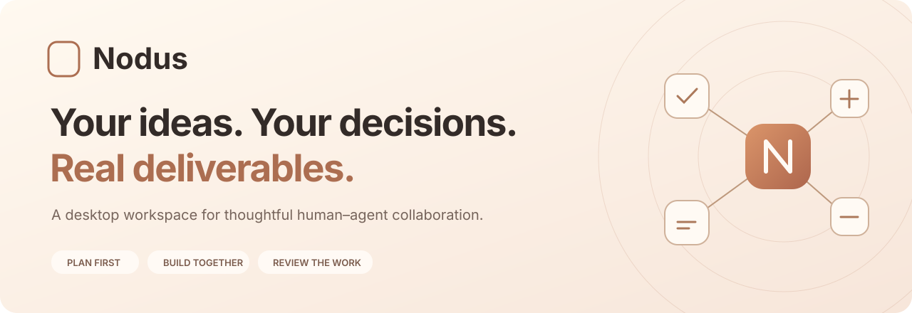
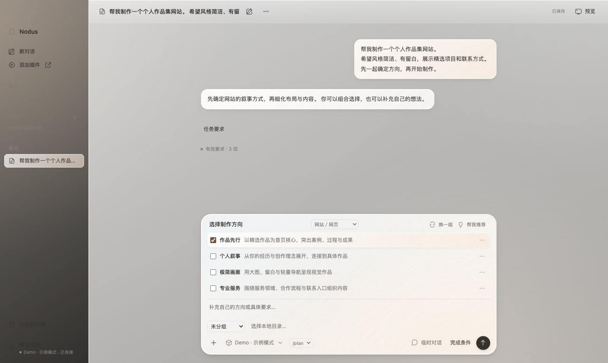

<p align="center">
  <a href="#quick-start">Quick start</a> ·
  <a href="https://github.com/alexwilliamclerk/Nodus/releases/latest">Download</a> ·
  <a href="docs/development.md">Development</a> ·
  <a href="CONTRIBUTING.md">Contributing</a>
</p>

<p align="center">
  <a href="https://github.com/alexwilliamclerk/Nodus/releases"></a>
  <a href="https://github.com/alexwilliamclerk/Nodus/actions/workflows/ci.yml"></a>
  <a href="LICENSE"></a>
  <a href="https://github.com/alexwilliamclerk/Nodus/releases/latest"></a>
</p>

<p align="center">
  <a href="README.md"></a>
  <a href="README.zh-CN.md"></a>
</p>

**Nodus is a desktop workspace for turning an idea into a deliverable you can inspect, revise, and keep.** Describe what you want to make, work through decisions with an AI agent, and review the files it produces. Requirements, choices, versions, and feedback stay together so you can see what was delivered and what still needs your judgment.

Nodus currently creates local websites, Markdown research reports, PPTX presentations, Python projects, and descriptive data analyses. It runs on macOS, Windows, and Linux with a model connection you provide.



<sub>Screenshot of the actual application using a synthetic task and a mocked planning response. The application interface is currently in Chinese.</sub>

## Quick start

Download the latest package for your platform. Packaged builds include Electron and the Pi SDK; you do not need to install Node.js or the Pi CLI to use the app.

| Platform | Package | One-line download and launch |
| --- | --- | --- |
| macOS · Apple Silicon | `Nodus-v{version}-macOS-arm64.dmg` | [Latest release](https://github.com/alexwilliamclerk/Nodus/releases/latest) or Terminal command below |
| Windows · x64 | `Nodus-v{version}-Windows-x64.exe` | [Latest release](https://github.com/alexwilliamclerk/Nodus/releases/latest) or PowerShell command below |
| Linux · x64 | `Nodus-v{version}-Linux-x86_64.AppImage` | [Latest release](https://github.com/alexwilliamclerk/Nodus/releases/latest) or Terminal command below |

New releases display the version in each installer filename, following the platform-specific pattern used by [CC Switch](https://github.com/farion1231/cc-switch/releases). The commands below use stable compatibility download links and save files under versioned names, so they also work with earlier Nodus releases.

**macOS — download and open the disk image:**

```bash
tag=$(curl -fsSL -o /dev/null -w '%{url_effective}' 'https://github.com/alexwilliamclerk/Nodus/releases/latest' | sed 's#.*/##') && file="$HOME/Downloads/Nodus-$tag-macOS-arm64.dmg" && curl -fL --retry 3 'https://github.com/alexwilliamclerk/Nodus/releases/latest/download/Nodus-mac-arm64.dmg' -o "$file" && open "$file"
```

Drag **Nodus** into Applications after opening the image.

**Windows — download and start the installer in PowerShell:**

```powershell
$ErrorActionPreference='Stop'; $release=Invoke-RestMethod 'https://api.github.com/repos/alexwilliamclerk/Nodus/releases/latest'; $file=Join-Path $env:TEMP "Nodus-$($release.tag_name)-Windows-x64.exe"; Invoke-WebRequest 'https://github.com/alexwilliamclerk/Nodus/releases/latest/download/Nodus-windows-x64.exe' -OutFile $file; Start-Process $file
```

**Linux — install and choose whether to remove older AppImages after testing the new app:**

```bash
mkdir -p "$HOME/.local/bin" && curl -fL --retry 3 'https://raw.githubusercontent.com/alexwilliamclerk/Nodus/main/scripts/install-linux.sh' -o "$HOME/.local/bin/Nodus-install-linux.sh" && bash "$HOME/.local/bin/Nodus-install-linux.sh"
```

Linux AppImage may require a FUSE runtime supplied by your distribution. Intel Mac, Windows ARM, and Linux ARM builds are not available yet. See [Releases](https://github.com/alexwilliamclerk/Nodus/releases) for SHA-256 checksums and version notes.

Once Nodus opens:

1. Add a model connection and verify it. You need valid credentials from your chosen provider.
2. Describe your goal, add source materials if needed, and choose a local directory for the result.
3. In the default `/plan` mode, select a direction, refine the requirements, and confirm before production starts.
4. Preview the files, inspect the checks, request changes, or accept a version.

> Need help? Read the [user guide](docs/guide.md) or [open an issue](https://github.com/alexwilliamclerk/Nodus/issues) with a reproducible example. Do not include API keys or private task data in an issue.

## Key features

**1. Plan first, then build.** `/plan` presents options and waits for your submitted choices before making a deliverable. `/goat` works within an explicit authorization, with up to three production attempts per submission. You can stop a task at any time; restarting Nodus does not resume paid model calls automatically.

**2. Keep requirements editable.** Submitted requirements are stored separately from the conversation. You can inspect their source, edit or retire an item, and see its change history. They remain task data supplied to the agent, not higher-priority system instructions.

**3. Review real files and versions.** Preview the current work, score it, request a revision, or restore an earlier version into a new one. Export a selected version to your own local directory.

**4. See what the checks support.** Nodus keeps file checks, model-assisted requirement review, and your acceptance distinct. A generated file is not proof that every goal was met; requirements without reliable evidence remain open for review.

**5. Connect your own model.** Implemented connection options include OpenAI (GPT), Anthropic (Claude), DeepSeek, Kimi, GLM, MiniMax, and Qwen. API keys stay in memory unless you explicitly choose encrypted local storage. Availability depends on the provider, account, region, and model.

**6. Search when you need current sources.** Configure a compatible current model API key or a separate Brave, Tavily, Qwen, OpenAI, or Anthropic search key. Search results appear as clickable sources in the chat and are available to later answers as unverified external material. Search remains off until configured.

**7. Keep a portable task backup.** Export conversations, materials, decisions, ratings, and deliverables as a ZIP. Application-saved credentials are excluded; sensitive text you put in a task or deliverable is not automatically removed.

**8. Choose your appearance.** Switch between light, dark, and system themes in Settings. Your choice is saved across restarts; website previews keep their own colors.

**9. Check for updates.** Settings can check GitHub Releases. Installed Windows and Linux AppImage builds can verify an update, then install and restart after your confirmation; Linux lets you keep a backup of the previous AppImage. On macOS, the update button opens the matching GitHub release so you can download the DMG and choose whether to replace the old app in Finder. Chats and work files are retained. Windows also provides a direct uninstall entry and [recovery steps for a damaged uninstaller](docs/windows-uninstall.md).

**10. Switch interface language.** Choose Simplified Chinese or English in Settings. The interface and native menus change immediately, and the choice survives restarts. Existing conversations and work files keep their original language; new AI-generated choices follow the selected interface language unless your task requests otherwise.

## What Nodus can produce

| Deliverable | Files | Current scope |
| --- | --- | --- |
| Website | HTML, CSS, JavaScript, local assets | Local preview and reference checks; no full backend or automatic deployment |
| Research report | Markdown and a source list | Structure and source-status checks; search results are not independent fact verification |
| Presentation | PPTX and preview | Primarily titles, bullets, and speaker notes |
| Python project | Source, dependencies, instructions | Syntax checks; generated code is not run automatically |
| Data analysis | Input snapshots, code, statistics, explanation | Descriptive statistics; input data and local Python 3 required |
| Word document | DOCX and editable JSON source | Text blocks and basic tables |
| Excel workbook | XLSX and editable JSON source | Basic sheets, text, numbers, and Boolean cells |
| Source code | Source files and README | File checks; generated code is not executed |

PDF and DOCX materials support text extraction, without OCR or layout reconstruction. Image understanding requires a vision-capable model. Complex Word/Excel layout and unrestricted media layout are not part of the current product.

## Using Nodus

Nodus saves tasks and files locally. Materials supplied to a configured model are sent to that model's service, so local storage does not mean offline inference. You can configure multiple model connections and switch between them when no task is running.

The application interface can be switched between Chinese and English in Settings. The [user guide](docs/guide.md) has the full walkthrough, including task requirements, previews, model connections, and backups.

## Advanced setup

To run the source, install Node.js 24 and pnpm 11.19.0. Python checks and data analysis also need Python 3.10 or newer.

```bash
git clone https://github.com/alexwilliamclerk/Nodus.git
cd Nodus
pnpm install --frozen-lockfile --ignore-scripts
node node_modules/electron/install.js
pnpm start
```

See the [development guide](docs/development.md) for code structure, tests, and building installers. The app needs Electron; opening `index.html` directly in a browser is not supported.

## Contributing and support

Read [CONTRIBUTING.md](CONTRIBUTING.md) before opening a pull request. For a bug, include the Nodus version, operating system, CPU architecture, reproduction steps, and expected versus actual behavior. Use synthetic examples and keep credentials and private files out of public issues.

New versions appear on [GitHub Releases](https://github.com/alexwilliamclerk/Nodus/releases). The [changelog](CHANGELOG.md) records this version's capabilities and verification limits.

## Security and privacy

Report sensitive vulnerabilities through the repository's private reporting channel when available. See [SECURITY.md](SECURITY.md) for reporting guidance and credential handling. Current packages are not formally developer-signed or notarized, and clean-machine Windows and Linux installation has not been validated.

If Windows reports **“NSIS Error: Installer integrity check has failed”** when running `Uninstall Nodus.exe`, follow the [tested repair steps](docs/windows-uninstall.md) before trying again. Do not bypass the integrity check.

## License

Nodus is available under the [MIT License](LICENSE). Third-party dependencies retain their own licenses. The application is built with [Electron](https://www.electronjs.org/) and [Pi](https://github.com/earendil-works/pi).
